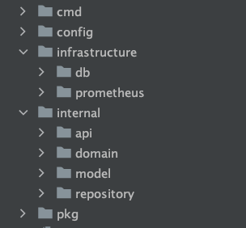
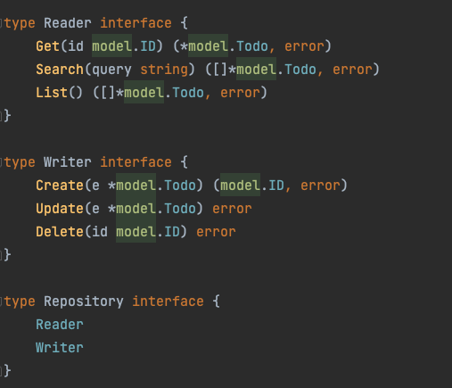
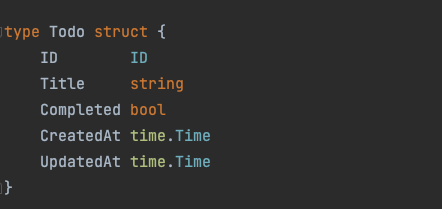

# Example project using clean microservice architecture
Some implications of Domain Driven Design and Hexagonal Architecture in golang project.

# Table of Contents

- [I. Introduction](#i-introduction)
    - [Overview](#overview)
    - [Todo application business requirements](#todo-application-business-requirements)
- [II. Technologies and Technical Features](#ii-technologies-and-technical-features)
    - [Technical Features](#technical-features)
- [III. Quick start - running the ToDo App](#iii-quick-start---running-the-todo-app)
    - [Prerequisites](#prerequisites)
    - [Running the app](#running-the-app)
    - [Calling REST endpoints](#calling-rest-endpoints)
- [IV. Understanding the project structure](#iv-running-in-development-mode)
    - [A. Core directory](#a-core-directory-structure)
    - [B. Infrastructure directory](#b-infrastructure-directory-structure)
- [V. Theoretical review](#v-conclusion)
    - [Hexagonal Architecture](#hexagonal-architecture)
    - [Domain Driven Design(DDD)](#domain-driven-designddd)
    - [Key advantages of using DDD](#key-advantages-of-using-ddd)
    - [DDD & Hexagonal Architecture](#ddd--hexagonal-architecture)
- [VI. Conclusion](#vi-conclusion)

# I. Introduction

Designing complex software is a challenging task, and we acquired this knowledge through our own difficult experiences. 
It is crucial to begin by designing the software correctly to ensure its resilience and maintainability. 
While there are abundant resources on constructing robust and sustainable software, the real challenge lies in implementing these principles effectively. 
Consequently, we have developed a comprehensive example that we wish had been available when we first began learning these concepts and technologies. 
Our team has invested significant effort into building a clean and modular codebase, which closely resembles production-ready code. 
Our objective is to offer valuable insights into advanced software architecture concepts.

## Overview
The code has been written using Golang, but the principles and patterns employed are not specific to any particular technology.
The project features an over-engineered ToDo app that includes crucial principles and patterns for ensuring your code is easy to modify, resilient, and straightforward to maintain.
We have also included detailed instructions on how to run the app.

Moreover, you will gain comprehensive knowledge of software design and architecture patterns and principles, including:
- Hexagonal Architecture
- Domain-Driven Design

The ToDo application is a straightforward application designed for managing tasks. 
Users have the ability to add new tasks, mark them as complete, mark them as incomplete, and modify the task titles as required.

# II. Technologies and Technical Features

## Technical Features
Here are listed some of the specific technologies used for the implementation of the project:
* **Databases - Persistence**: [MariaDB](https://mariadb.org//)
* **Testing**: [GoMock](https://github.com/golang/mock)
* **External Communication Protocols**: [REST](https://en.wikipedia.org/wiki/Representational_state_transfer))
* **Container Technology**: [Docker](https://www.docker.com/)

# III. Quick start - running the ToDo App

## Prerequisites
* **Go** ([link](https://golang.org/doc/install))
* **Docker** ([link](https://docs.docker.com/engine/install/))
* **docker-compose** ([link](https://docs.docker.com/compose/install/))

## Running the app
In order to run the application you need to follow the steps below:
* Run:
```bash
 git clone https://github.com/zdarovich/clean-code-example.git
```
* Navigate  to the folder:
```bash
cd clean-code-example
```
* Run:
```bash
docker compose -p clean-code-todo-app up -d
```
* Run:
```bash
go run cmd/todoapp/main.go
``` 

## Calling REST endpoints
* Add todo
```
curl -X "POST" "http://localhost:8080/v1/todo" \
     -H 'Content-Type: application/json' \
     -H 'Accept: application/json' \
     -d $'{
  "title": "todo1"
}'
```
*  Search todo
```
curl "http://localhost:8080/v1/todo?title=todo1" \
     -H 'Content-Type: application/json' \
     -H 'Accept: application/json'
```
*  Complete todo
```
curl -X "PATCH" "http://localhost:8080/v1/todo/5e37cccf-a67d-4d6e-8b76-18bda53df94f" \
     -H 'Content-Type: application/json' \
     -H 'Accept: application/json' \
     -d $'{
  "completed": true
}'
```
*  Get todo
```
curl "http://localhost:8080/v1/todo/5e37cccf-a67d-4d6e-8b76-18bda53df94f" \
     -H 'Content-Type: application/json' \
     -H 'Accept: application/json'
```

# IV. Understanding the project structure

The main project structure is located at the `/internal` folder.
The starting point for the whole application is the `cmd/todoapp/main.go` file.


<p align="center" style="margin-bottom: 0px !important;">
  
</p>

<p align="center">
Project Structure Overview
</p>

The main folders are in the `/internal` directory following:

* api
* domain
* model
* repository

## API Folder

The presentation layer of the application is located in the api folder and consists of the driving adapters for the infrastructure layer of the Hexagonal Architecture. 
In this folder, you can find the RESTful todo handler in the `internal/api/handler` directory, along with the [Data Transfer Objects (DTOs)](https://en.wikipedia.org/wiki/Data_transfer_object) for these handlers.

The primary role of the presentation layer, also known as controllers, is to call the application layer using the command and query handlers. This design ensures a clear separation of concerns between the different components of the application, making it easier to maintain, scale, and develop.
## Domain Folder

The domain folder contains the **data access layer** (driven adapters of the infrastructure layer) - concrete implementations of the ports `/daomain/todo/interface` ([Hexagonal Architecture](https://en.wikipedia.org/wiki/Hexagonal_architecture_(software))) of the application, organised by the specific **domain contexts** ([DDD](https://en.wikipedia.org/wiki/Domain-driven_design)) of the application. 
<p align="center" style="margin-bottom: 0px !important;">
  
</p>

<p align="center">
Interface implementations as ports of the domain layer
</p>

These concrete implementations are specific **repository implementations** in `/repository` directory.

## Model Folder
This package contains the definitions of our domain entities and their corresponding unit tests.
<p align="center" style="margin-bottom: 0px !important;">
  
</p>

<p align="center">
Domain model
</p>

## Repository Folder
Contains the persistence layer of our application. 
The outermost layer is generally composed of frameworks and tools such as the Database and etc.
This layer enables us to migrate to any database technology without the need to refactor the business logic.

## Tests
Each folder contains the use case test files with `*_test.go` suffixes or **behaviour driven tests** (from [BDD](https://en.wikipedia.org/wiki/Behavior-driven_development)).

These tests verify the behavior of the system, meaning they test the business logic by testing the **application layer** components. 
By testing the business logic through the application layer instead of the domain layer (using unit tests), it becomes easier to modify the domain layer frequently without the need to update all the unit tests each time. 
This approach allows for more flexibility and adaptability to change.
The tests use **mock repositories** and **mock services**(`internal/domain/todo/mock` ) as adapters (concretions) of the ports to **emulate actual repositories and services**. This helps to **test the business logic fast**, **without using actual databases and external services** to test the business logic.


# V. Theoretical review
## Hexagonal Architecture

The project follows the [Hexagonal Architecture](https://en.wikipedia.org/wiki/Hexagonal_architecture_(software)), also known as the Ports and Adapters architecture. In this architecture, the layers are similar to other designs, but the business (or domain) layer is given a more prominent position at the core of the architecture. 
As a result, the Data Access Layer (persistence) is moved to the outer "repository" layer.

<p align="center" style="margin-bottom: 0px !important;">
  
</p>

<p align="center">
Hexagonal Architecture
</p>

The Hexagonal Architecture consists of four layers, which are sometimes grouped into three layers. The Domain Layer is at the center, surrounded by the Application Layer, and then the Infrastructure Layer. This structure is similar to the Layered Architecture, with the Infrastructure Layer containing the Presentation and Data Access Layers, and the Application and Domain Layers being separate.

However, the Hexagonal Architecture has a different flow of dependencies compared to the Layered Architecture. The dependencies flow from the outside to the inside, starting with the Infrastructure Layer, then to the Application Layer, and finally to the Domain Layer.

This approach allows the Domain Layer to be simplified and defined precisely as needed without having any dependencies on the other layers.

---
## Domain Driven Design(DDD)
Domain-Driven Design (DDD) is a software development approach or methodology that emphasizes building a thorough understanding of a business domain by creating a model of its processes and rules. DDD is not just about coding; it's a philosophy on how to develop software for complex domains and simplify the development of systems that solve those domain-specific problems.

**In essence, DDD has three core principles:**
- Focus on the core domain and logic to build domain models
- Use the domain model as a base for all software designs
- Collaborate with domain experts to improve the domain model and resolve any emerging domain-related issues

## Key advantages of using DDD
- **Better alignment with business goals** - DDD places a strong emphasis on understanding the business domain, and as a result, the software developed is better aligned with the goals of the business
- **Flexibility and adaptability** - By focusing on the core domain, DDD allows for more flexibility and adaptability in the face of changing business needs or requirements
- **Reduced risk of project failure** - With a clear understanding of the business domain and an emphasis on collaboration with domain experts, DDD reduces the risk of developing software that does not meet the needs of the business or users, reducing the risk of project failure.
- 
## DDD & Hexagonal Architecture
- Improved separation of concerns - Both DDD and hexagonal architecture emphasize modularity and separation of concerns, allowing for better organization and easier maintenance of the codebase.
- Greater flexibility: The hexagonal architecture allows for easy switching of external dependencies, while DDD promotes the creation of a flexible domain model that can evolve with the business needs.
- Better testing: The hexagonal architecture makes it easy to test the application without relying on external dependencies, while DDD promotes the creation of testable domain models.
- Improved communication: DDD's ubiquitous language ensures that everyone involved in the project understands the terminology and definitions being used, improving communication between developers and domain experts.
- Improved maintainability: By focusing on the core domain and creating a well-defined domain model, software built using DDD and hexagonal architecture is easier to understand and maintain over time.

---

# VI. Conclusion
To summarize, we have reviewed the following:
- Hexagonal architecture is a software architecture that puts the Domain Layer at the core without dependencies on any other layer. The Application Layer, which surrounds the Domain Layer, coordinates the services and together they form the Application Core. The Infrastructure Layer, consisting of the User Interface, Database, and other components, is located on the outer layer. To connect the Application Core with the Infrastructure Layer, it is necessary to use Ports and Adapters, which guarantee a clear separation of concerns, resulting in improved modularity, testability, and maintainability of a software system.
- Domain-driven design (DDD) is a software development approach that focuses on creating well-defined, easy to understand domain models, particularly in the Application Core (Domain and Application Layers of the Hexagonal Architecture). It aims to align the software with the business needs, making the business logic easier to modify. DDD is particularly effective when used in conjunction with Ports and Adapters to maintain a clear separation between the Application Core and the Infrastructure Layer.

The overarching idea is the following:
- A user initiates a request, which is sent to the controller as a command/query in the form of a DTO
- The controller uses an adapter and a port to transfer the request to an application service within the Application Core
- The Application Service handles the command/query and communicates with the Domain Layer (domain services, aggregates, entities) to execute the required business logic
- The Application Core interacts with the Database Layer through Ports and Adapters to retrieve and persist relevant data
- The Database Layer maps the data and retrieves/persists it to a database, then passes it back to the Application Core
- The Application Core returns data/confirmation to the Controllers through Ports and Adapters
- Finally, the Controllers return the data back to the User.

---

# Additional learning resources

## Articles

- [The Clean Architecture](http://blog.cleancoder.com/uncle-bob/2012/08/13/the-clean-architecture.html) - Robert C. Martin (Uncle Bog)
- [Better Software Design with Clean Architecture](https://fullstackmark.com/post/11/better-software-design-with-clean-architecture) - FullStackMark
- [Clean Domain-Driven Design](https://medium.com/unil-ci-software-engineering/clean-domain-driven-design-2236f5430a05) - George
